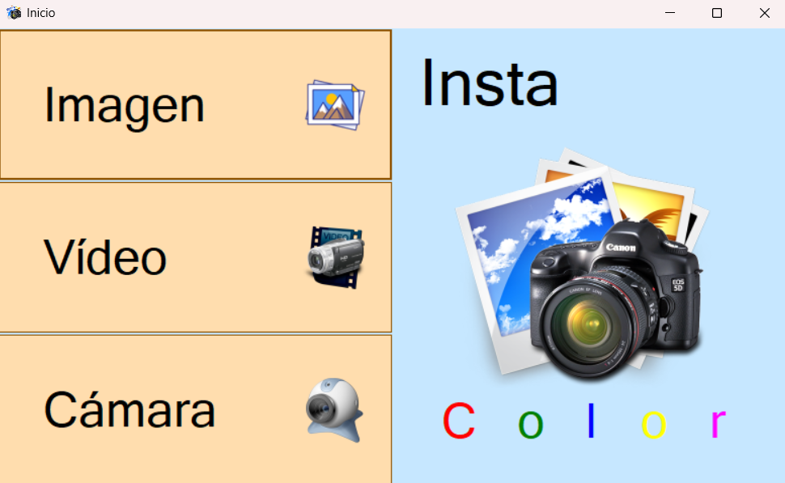
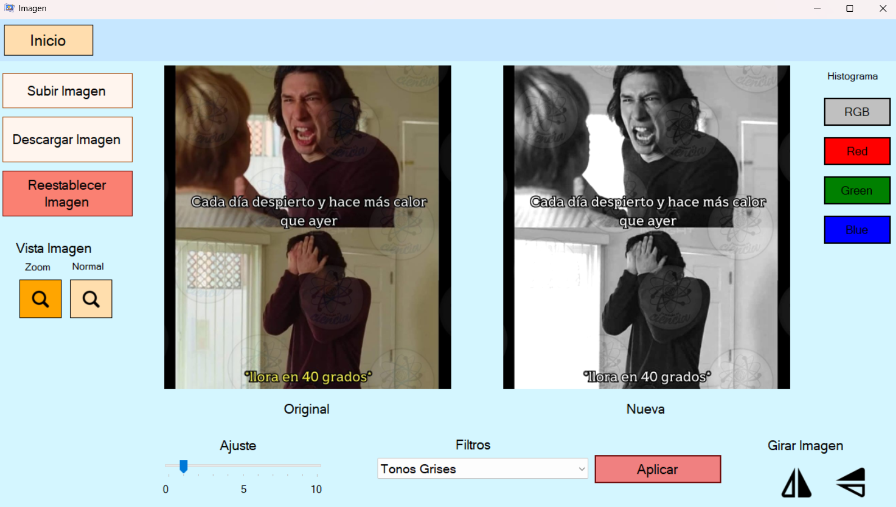
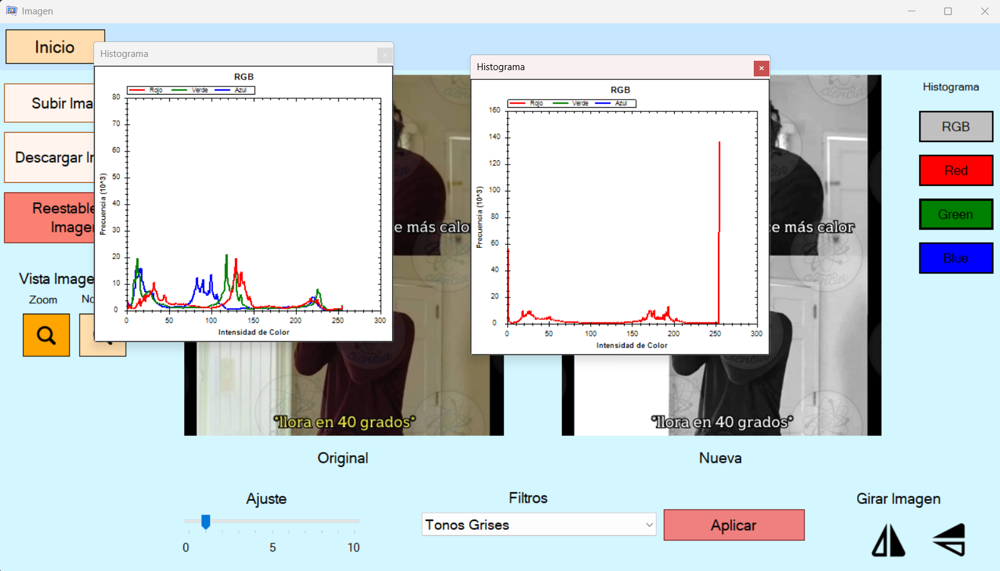
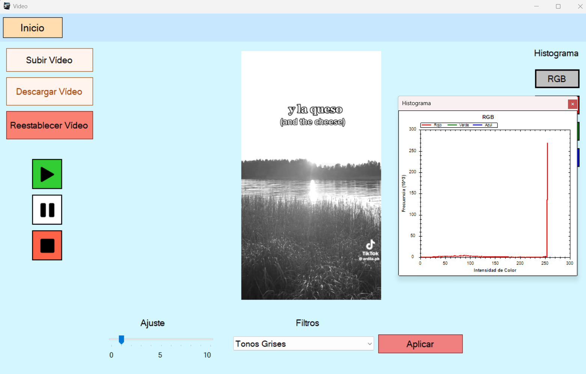
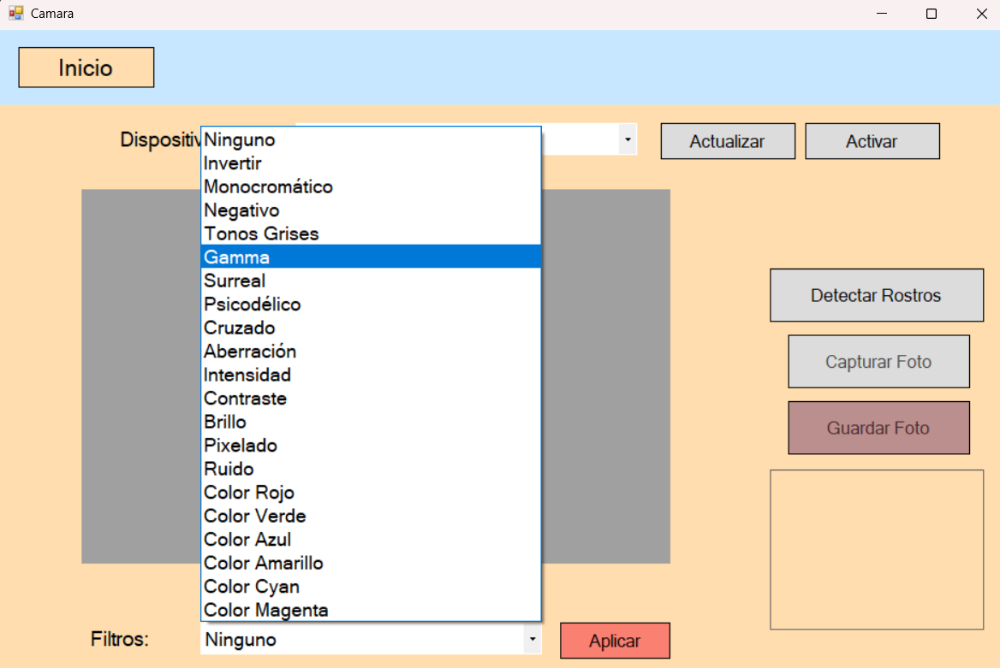

# Proyecto de aplicación multimedia para filtros en Imágenes, Vídeos y Cámara
### Versión 1.0.2
### Tecnologías
    * C# + .NET Framework 4.8 
    * Librerías: WinForms, AForge.NET, Accord, EmguCV, ZedGraph
## Manual de Usuario
[Manual](Manual%20de%20usuario.pdf)

## Anexos
### Menú de Inicio

### Imágenes

### Histogramas

### Video

### Cámara
